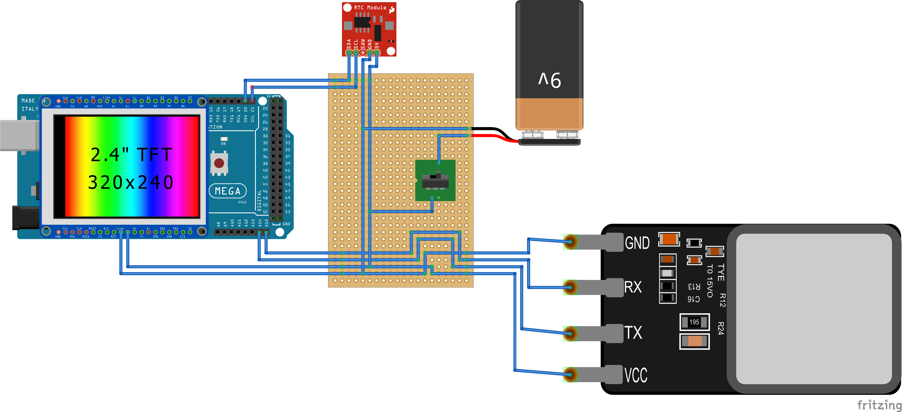

# fingerprint-attendance
Arduino &amp; Biometric (Fingerprint) based attendance system with desktop client. (A final year CS project made at GAC-CBE)

This was one of my projects that i made for my friend's final year CS project back in my college days.

I used Arduino Mega, Adafruit Fingerprint Sensor & 240x320 TFT Display to create the device that records the attendance. And wrote a desktop client that writes students and staffs details to the device. It can also reads the attendance data from device, consolidate it and shows/prints the report.

I wanted to write a more detailed guide with step by step insturctions and images. But unfortunately the person to whom for I made this project didn't gave back the device after finishing their exhibit. So now I am only releasing a small video that I took when making the device & the full arduino & desktop client's source code.

## Diagram

## Demo

